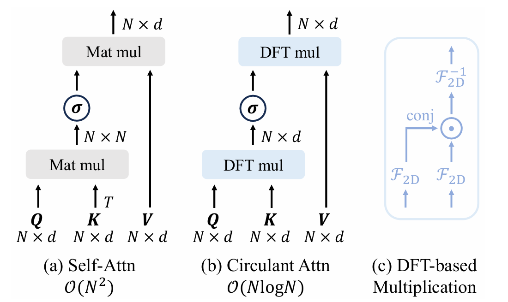
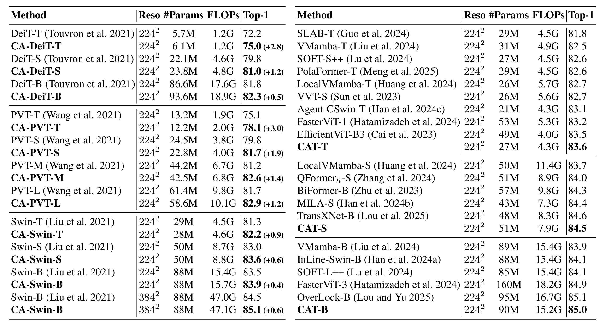
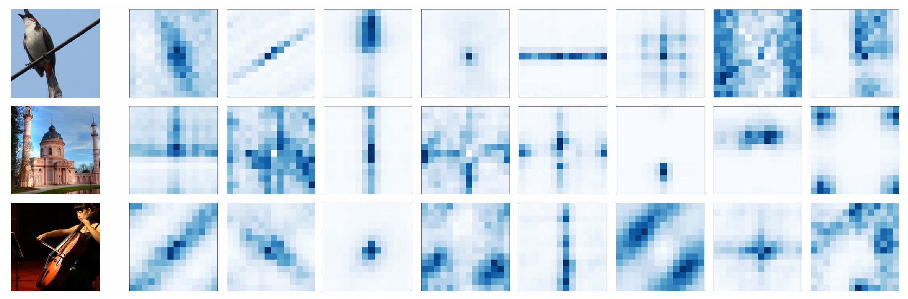

# Vision Transformers are Circulant Attention Learners

This repo contains the official PyTorch code and pre-trained models for **Circulant Attention**.

+ [Vision Transformers are Circulant Attention Learners](https://arxiv.org/abs/2512.21542)


## News

- January 12 2026: Code for CA-DeiT is released.

## Abstract

The self-attention mechanism has been a key factor in the advancement of vision Transformers. However, its quadratic complexity imposes a heavy computational burden in high-resolution scenarios, restricting the practical application. Previous methods attempt to mitigate this issue by introducing handcrafted patterns such as locality or sparsity, which inevitably compromise model capacity. In this paper, we present a novel attention paradigm termed **Circulant Attention** by exploiting the inherent efficient pattern of self-attention. Specifically, we first identify that the self-attention matrix in vision Transformers often approximates the Block Circulant matrix with Circulant Blocks (BCCB), a kind of structured matrix whose multiplication with other matrices can be performed in $\mathcal{O}(N\log N)$ time. Leveraging this interesting pattern, we explicitly model the attention map as its nearest BCCB matrix and propose an efficient computation algorithm for fast calculation. The resulting approach closely mirrors vanilla self-attention, differing only in its use of BCCB matrices. Since our design is inspired by the inherent efficient paradigm, it not only delivers $\mathcal{O}(N\log N)$ computation complexity, but also largely maintains the capacity of standard self-attention. Extensive experiments on diverse visual tasks demonstrate the effectiveness of our approach, establishing circulant attention as a promising alternative to self-attention for vision Transformer architectures.

## Circulant Attention

Circulant attention largely inherits the paradigm of self-attention, except for employing BCCB attention matrices. This simple modification enables our design to be efficiently calculated through DFT-based multiplication, thereby achieving $\mathcal{O}(N\log N)$ complexity.

<p align="center">
    
</p>

Mathematically,

$$a=\frac{1}{N\sqrt{d}}\left[\mathcal{F}_{\rm 2D}^{-1}\left(\overline{\mathcal{F}_{\rm 2D}(Q)}\odot\mathcal{F}_{\rm 2D}(K)\right)\right] \cdot \mathbf{1}_{d\times1},$$

$$O=\mathcal{F}_{\rm 2D}^{-1}\left(\overline{\mathcal{F}_{\rm 2D}(\sigma(a))}\odot\mathcal{F}_{\rm 2D}(V)\right).$$


## Results

- ImageNet-1K results.

<p align="center">
    
</p>


- An illustration of the equivalent global convolution kernels from CA-DeiT.

<p align="center">
    
</p>


## Dependencies

- Python 3.9
- PyTorch==1.11.0
- torchvision==0.12.0
- numpy
- timm==0.4.12
- yacs

The ImageNet dataset should be prepared as follows:

```
imagenet
├── train
│   ├── class1
│   │   ├── img1.jpeg
│   │   └── ...
│   ├── class2
│   │   ├── img2.jpeg
│   │   └── ...
│   └── ...
└── val
    ├── class1
    │   ├── img3.jpeg
    │   └── ...
    ├── class2
    │   ├── img4.jpeg
    │   └── ...
    └── ...
```

## Pretrained Models

| model  | Resolution | #Params | FLOPs | acc@1 |            config            |                      pretrained weights                      |
| ------ | :--------: | :-----: | :---: | :---: | :--------------------------: | :----------------------------------------------------------: |
| CA-DeiT-T |    224     |   6.1M   | 1.2G  | 75.0  | [config](./cfgs/ca_deit_t.yaml) | [TsinghuaCloud](https://cloud.tsinghua.edu.cn/f/51b342f641b440a9ad53/?dl=1) |
| CA-DeiT-S |    224     |   23.8M   | 4.8G  | 81.0  | [config](./cfgs/ca_deit_s.yaml) | [TsinghuaCloud](https://cloud.tsinghua.edu.cn/f/02d8767a0981445b9606/?dl=1) |
| CA-DeiT-B |    224     |   93.6M   | 18.9G | 82.3  | [config](./cfgs/ca_deit_b.yaml) | [TsinghuaCloud](https://cloud.tsinghua.edu.cn/f/0dee573498554f11a6c7/?dl=1) |

## Model Training and Inference

- Evaluate CA-DeiT on ImageNet:

```
python -m torch.distributed.launch --nproc_per_node=8 main.py --cfg <path-to-config-file> --data-path <imagenet-path> --output <output-path> --eval --resume <path-to-pretrained-weights>
```

- To train CA-DeiT on ImageNet from scratch, run:

```
python -m torch.distributed.launch --nproc_per_node=8 main.py --cfg <path-to-config-file> --data-path <imagenet-path> --output <output-path> --amp
```

## Acknowledgements

This code is developed on the top of [Swin Transformer](https://github.com/microsoft/Swin-Transformer). 

## Citation

If you find this repo helpful, please consider citing us.

```latex
@inproceedings{han2025vision,
  title={Vision Transformers are Circulant Attention Learners},
  author={Han, Dongchen and Li, Tianyu and Wang, Ziyi and Huang, Gao},
  booktitle={Proceedings of the AAAI conference on artificial intelligence},
  year={2026}
}
```

## Contact

If you have any questions, please feel free to contact the authors. 

Dongchen Han: [hdc23@mails.tsinghua.edu.cn](mailto:hdc23@mails.tsinghua.edu.cn)
